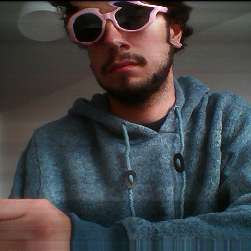

# 2Puck

  

## Introduction
This project has been developped in the context of the EPFL _Systèmes embarqués et robotique_, given by Professor Mondada. The objectif of this course is to have an introduction to embedded systems using the ePuck robot developped by GCtronics. The only constraint on the project was to use the IR sensors. We decided to develop a Guitar Hero game, in which the ePuck is placed in the center of two musicians, it demands a song to be played, listens to both musicians play the requested riff, compares it to the original one and calculates who was most faithful to it. Once the winner is decided, the robot paths towards him, avoiding obstacles on the way and takes a picture of him, which is then showed on the PC.

## Installation
1. Install the [eclipse development environment](https://www.gctronic.com/doc/index.php?title=e-puck2_robot_side_development)
2. Download this repository
3. Open the 2Puck subfolder in eclipse
4. Flash the code and enjoy the game :)

## Promotional Video
https://www.youtube.com/watch?v=MV20y38jaJc
## Functional Video
https://www.youtube.com/watch?v=bkgnAVjj2WI

